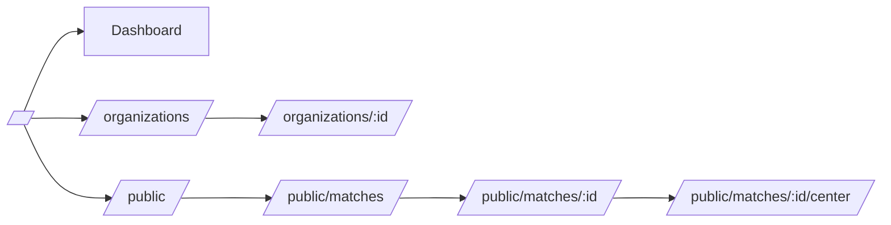
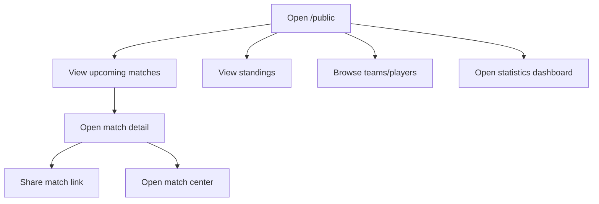

# Arsitektur Sistem & Modul

## Diagram Arsitektur (High Level)

```mermaid
flowchart TB
  user[User / Admin] --> rr[React Router]
  rr --> pages[Route Pages (src/pages)]
  pages --> layout[Layouts (DashboardLayout/AdminLayout/PublicLayout)]
  pages --> ui[UI Components (src/components)]
  pages --> modules[Domain Modules (src/modules)]
  pages --> lib[Domain Services & Utils (src/lib)]

  modules --> players[players module]
  modules --> teams[teams module]
  modules --> tournaments[tournaments module]
  modules --> realtime[realtime module]

  lib --> matches[matches service]
  lib --> venues[venues service]
  lib --> standings[standings service]
  lib --> orgs[organizations service]
  lib --> metrics[player metrics]

  pages --> rq[React Query]
  rq --> lib
```

## Diagram Routing (Ringkas)



## Flowchart Proses Bisnis (Contoh Utama)

### 1) Public Visitor Flow



### 2) Admin Organization Flow

```mermaid
flowchart TD
  A[Open /organizations] --> B[Search/Filter orgs]
  B --> C[Click org row]
  C --> D[/organizations/:id detail]
  D --> E[Review overview]
  D --> F[Search/filter members]
  D --> G[Review metadata]
```

## Modul & Penjelasan (src/modules)

### Players
- Lokasi: [src/modules/players](file:///d:/PROYEK%20WEB%20MASTER/APLIKASI/tourney-hub-plus/src/modules/players)
- Fungsi: Player directory UI (list/profile/registration) + in-memory CRUD.
- Entry pages:
  - [PlayersPage.tsx](file:///d:/PROYEK%20WEB%20MASTER/APLIKASI/tourney-hub-plus/src/pages/PlayersPage.tsx)
  - [PlayerProfilePage.tsx](file:///d:/PROYEK%20WEB%20MASTER/APLIKASI/tourney-hub-plus/src/pages/players/PlayerProfilePage.tsx)
  - [PlayerRegistrationPage.tsx](file:///d:/PROYEK%20WEB%20MASTER/APLIKASI/tourney-hub-plus/src/pages/players/PlayerRegistrationPage.tsx)
- Service: [playerService.ts](file:///d:/PROYEK%20WEB%20MASTER/APLIKASI/tourney-hub-plus/src/modules/players/services/playerService.ts)

### Teams
- Lokasi: [src/modules/teams](file:///d:/PROYEK%20WEB%20MASTER/APLIKASI/tourney-hub-plus/src/modules/teams)
- Fungsi: Team management UI, roster, stats, registration.
- Service: [teamService.ts](file:///d:/PROYEK%20WEB%20MASTER/APLIKASI/tourney-hub-plus/src/modules/teams/services/teamService.ts)

### Tournaments
- Lokasi: [src/modules/tournaments](file:///d:/PROYEK%20WEB%20MASTER/APLIKASI/tourney-hub-plus/src/modules/tournaments)
- Fungsi: tournament create/detail/bracket/schedule, modular tabs.
- Service: [tournamentService.ts](file:///d:/PROYEK%20WEB%20MASTER/APLIKASI/tourney-hub-plus/src/modules/tournaments/services/tournamentService.ts)

### Realtime
- Lokasi: [src/modules/realtime](file:///d:/PROYEK%20WEB%20MASTER/APLIKASI/tourney-hub-plus/src/modules/realtime)
- Fungsi: abstraction realtime provider + socket service (stub).
- Hook: [useRealtime.tsx](file:///d:/PROYEK%20WEB%20MASTER/APLIKASI/tourney-hub-plus/src/modules/realtime/hooks/useRealtime.tsx)

## Service Layer & Utilities (src/lib)

### Matches
- File: [matches.ts](file:///d:/PROYEK%20WEB%20MASTER/APLIKASI/tourney-hub-plus/src/lib/matches.ts)
- Digunakan oleh:
  - [MatchesPage.tsx](file:///d:/PROYEK%20WEB%20MASTER/APLIKASI/tourney-hub-plus/src/pages/MatchesPage.tsx)
  - [MatchCenterPage.tsx](file:///d:/PROYEK%20WEB%20MASTER/APLIKASI/tourney-hub-plus/src/pages/MatchCenterPage.tsx)
  - Public matches pages di [src/pages/public](file:///d:/PROYEK%20WEB%20MASTER/APLIKASI/tourney-hub-plus/src/pages/public)

### Organizations
- File: [organizations.ts](file:///d:/PROYEK%20WEB%20MASTER/APLIKASI/tourney-hub-plus/src/lib/organizations.ts)
- Digunakan oleh:
  - [OrganizationsPage.tsx](file:///d:/PROYEK%20WEB%20MASTER/APLIKASI/tourney-hub-plus/src/pages/OrganizationsPage.tsx)
  - [OrganizationDetailPage.tsx](file:///d:/PROYEK%20WEB%20MASTER/APLIKASI/tourney-hub-plus/src/pages/organizations/OrganizationDetailPage.tsx)

### Standings
- File: [standings.ts](file:///d:/PROYEK%20WEB%20MASTER/APLIKASI/tourney-hub-plus/src/lib/standings.ts)
- UI: [LeagueStandingsTable.tsx](file:///d:/PROYEK%20WEB%20MASTER/APLIKASI/tourney-hub-plus/src/components/LeagueStandingsTable.tsx)

### Venues
- File: [venues.ts](file:///d:/PROYEK%20WEB%20MASTER/APLIKASI/tourney-hub-plus/src/lib/venues.ts)
- UI: [VenueMap.tsx](file:///d:/PROYEK%20WEB%20MASTER/APLIKASI/tourney-hub-plus/src/components/venues/VenueMap.tsx), [VenuesPage.tsx](file:///d:/PROYEK%20WEB%20MASTER/APLIKASI/tourney-hub-plus/src/pages/VenuesPage.tsx)

### Statistics / Metrics
- File: [playerMetrics.ts](file:///d:/PROYEK%20WEB%20MASTER/APLIKASI/tourney-hub-plus/src/lib/playerMetrics.ts)
- Page: [StatisticsPage.tsx](file:///d:/PROYEK%20WEB%20MASTER/APLIKASI/tourney-hub-plus/src/pages/StatisticsPage.tsx)

## Catatan Konsistensi Data

Saat ini beberapa modul melakukan relasi berbasis nama (string) pada UI/demo data. Untuk produksi disarankan:
- Semua entity memiliki `id` konsisten.
- Relasi antar entity menggunakan `id` (contoh: match.homeTeamId, match.awayTeamId).

